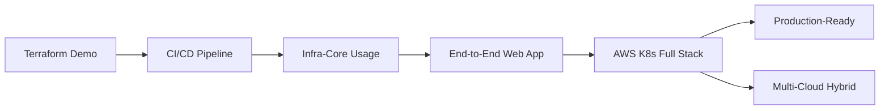

# Комплексные Case Studies

## Обзор

Эта секция содержит подробные end-to-end туториалы, демонстрирующие полный цикл развертывания приложений с использованием всех модулей инфраструктуры.

## 🎯 Доступные туториалы

### 1. End-to-End Web Application Deployment
[]()
[]()

Полный туториал по развертыванию веб-приложения (Frontend + Backend + Database) с использованием:
- infra-template (создание проекта)
- infra-network (VPC, Tailscale)
- infra-secrets (SOPS)
- infra-aws (S3, ECS, RDS)
- infra-ci (GitHub Actions)
- infra-monitoring (CloudWatch, Grafana)

[📓 Открыть ноутбук](./end-to-end-webapp-deployment.ipynb)

---

### 2. AWS Full Stack с Kubernetes (EKS)
[]()
[]()

Развертывание микросервисного приложения на Amazon EKS:
- EKS кластер (on-demand + spot instances)
- Istio Service Mesh
- ALB Ingress Controller
- ArgoCD (GitOps)
- Prometheus + Grafana
- Auto-scaling (HPA + Cluster Autoscaler)

[📓 Открыть ноутбук](./aws-k8s-fullstack.ipynb)

---

### 3. Multi-Cloud Hybrid Infrastructure
[]()
[]()

Гибридное развертывание с AWS + GCP + On-Premise:
- Multi-cloud Terraform setup
- Tailscale Mesh VPN
- AWS (Frontend, API, Database)
- GCP (BigQuery, ML API, Data Lake)
- On-Premise integration
- Cross-cloud data pipeline

[📓 Открыть ноутбук](./multicloud-hybrid-infrastructure.ipynb)

---

### 4. Production-Ready Infrastructure
[]()
[]()

Production setup со всеми best practices:
- High Availability (Multi-AZ)
- Security (WAF, KMS, Secrets Manager)
- Comprehensive Monitoring
- Backup & Disaster Recovery
- Auto-Scaling
- CI/CD с security scanning
- Compliance

[📓 Открыть ноутбук](./production-ready-infrastructure.ipynb)

---

## 📚 Базовые туториалы

Для тех, кто только начинает:

- [Terraform Demo](./terraform-demo.ipynb) - Введение в Infrastructure as Code
- [CI/CD Pipeline](./ci-cd-pipeline.ipynb) - Основы автоматизации
- [Infra-Core Usage](./infra-core-usage.ipynb) - Работа с базовыми модулями
- [Tailscale Mesh](./tailscale-mesh.ipynb) - Настройка VPN

---

## 🎓 Рекомендуемый путь обучения



### Для начинающих:
1. Terraform Demo
2. CI/CD Pipeline
3. Infra-Core Usage
4. End-to-End Web Application

### Для опытных:
1. End-to-End Web Application (освежить знания)
2. AWS K8s Full Stack
3. Production-Ready Infrastructure
4. Multi-Cloud Hybrid

---

## 🛠️ Требования

### Инструменты:
- Terraform >= 1.5.0
- AWS CLI >= 2.0
- kubectl >= 1.28 (для K8s)
- SOPS >= 3.7
- Helm >= 3.0 (для K8s)

### Учетные записи:
- AWS Account
- GCP Account (для multi-cloud)
- GitHub Account
- Tailscale Account

---

## 📖 Как использовать

### Локально:
```bash
pip install jupyter
cd notebooks
jupyter notebook
```

### В VS Code:
1. Установите расширение "Jupyter"
2. Откройте `.ipynb` файл
3. Запускайте ячейки

---

## ⚠️ Важно

- **Стоимость**: Развертывание будет стоить денег. Настройте billing alerts!
- **Безопасность**: Не коммитьте credentials. Используйте SOPS.
- **Очистка**: Не забывайте `terraform destroy` после тестирования.

---

## 📊 Статистика

| Метрика | Значение |
|---------|----------|
| Всего туториалов | 8 |
| Комплексных case studies | 4 |
| Общее время изучения | 13+ часов |
| Покрытых модулей | 8 (все infra-*) |

---

## 🤝 Вклад

Нашли ошибку или хотите улучшить туториал? Создайте Pull Request!

---

## 📞 Поддержка

- 📧 Email: support@v-grand.com
- 💬 Slack: [v-grand workspace](https://v-grand.slack.com)
- 📚 Документация: [infra-docs.v-grand.com](https://infra-docs.v-grand.com)

---

**Happy Learning! 🚀**
